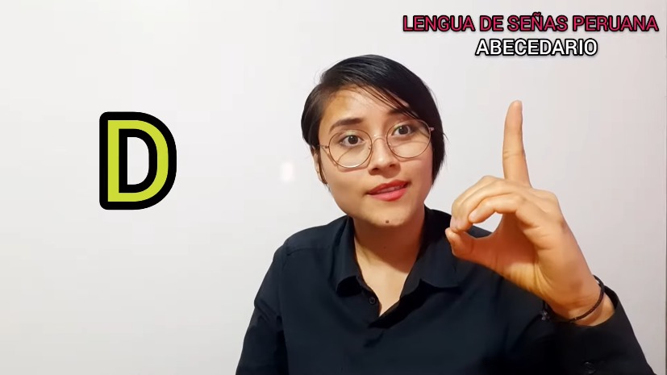
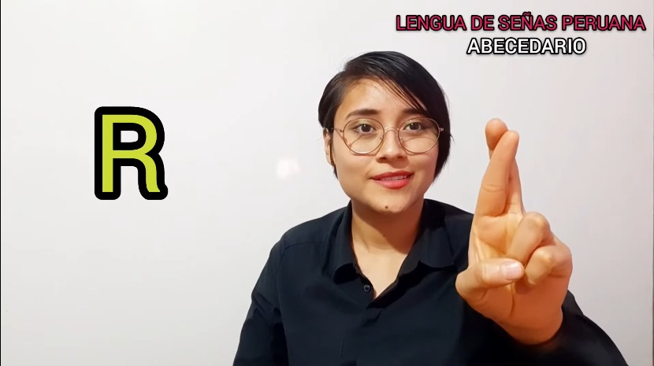
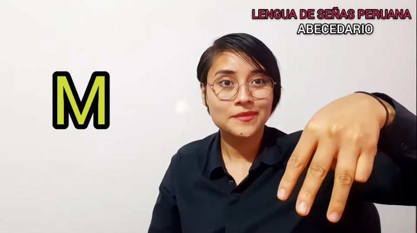
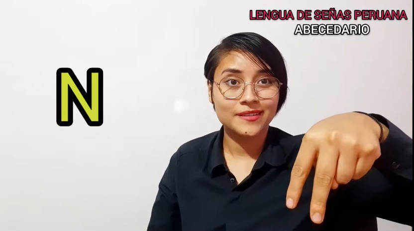

## ⚠️ Estado del Proyecto & Desafíos Actuales
El sistema reconoce con éxito las señas estáticas para **D, R, M y N**. Sin embargo, se encuentra en fase de optimización debido a los siguientes factores:
* **Falsos Positivos de Mano Abierta:** Al abrir la mano en reposo, el clasificador tiende a forzar la predicción hacia una de las 4 letras.
* **Similitud de Patrones:** Las transiciones y posiciones estructurales similares (ej. la cercanía anatómica entre los landmarks de la M y la N) generan fluctuaciones en la predicción.

### Próximos pasos:
1. Implementar más registros a la clase de fondo (`None`) para enseñarle al modelo a descartar patrones fuera del alcanse.
2. Incrementar el umbral de confianza (`predict_proba() > 0.85`) para estabilizar los fotogramas en OpenCV.

### Señas Utilizadas:
1. Letra "D"

2. Letra "R"

3. Letra "M"

4. Letra "N"

`Video de Referencia: https://youtu.be/xEsI4vFBLSQ?si=E8ErLnCdFNTGjW5d`